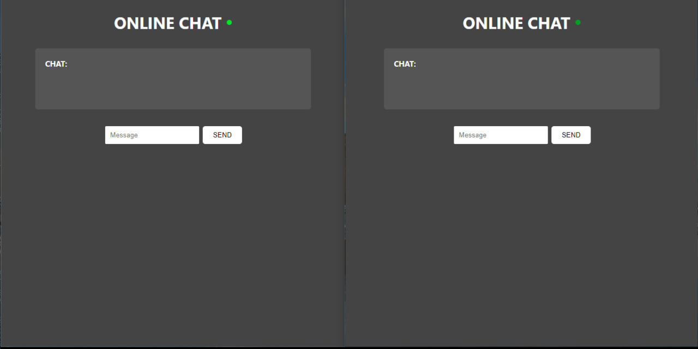

# IstisharyTalk

IstisharyTalk is a simple chat application that reads messages from a JSON file and displays them on a web page, automatically refreshing every second to show the latest messages.



### Prerequisites

- PHP (tested with PHP 7.4+)
- A web server (e.g., Apache) with PHP support, such as XAMPP for local development
- Web browser

### Installation

1. **Clone the repository or download the ZIP file:**
   ```bash
   git clone https://github.com/ademchaoua/IstisharyTalk.git
   cd IstisharyTalk
   ```

2. **Set up the project directories and files:**

Ensure the directory structure matches the one shown above.

3. **Configure the Web Server:**

    If using XAMPP, place the project folder inside the `htdocs` directory (e.g., `C:\xampp\htdocs\IstisharyTalk`).

4. **Create or ensure the existence of msgs.json:**

    In the `database` directory, create a `msgs.json` file if it doesn't exist and initialize it with an empty array:

     ```json
    []
     ```
### Permissions

Ensure that the `database` directory and the `msgs.json` file are writable by the web server.

### Running the Application

1. **Start your web server (e.g., XAMPP):**

   * Open the XAMPP control panel.
   * Start the Apache server.

2. **Access the application in your web browser:**

    Navigate to `http://localhost/IstisharyTalk/`.

## License

This project is licensed under the MIT License - see the [LICENSE](LICENSE) file for details.

```vbnet

Feel free to adjust the `README.md` to better fit your project's specifics or to include additional information as needed.

```