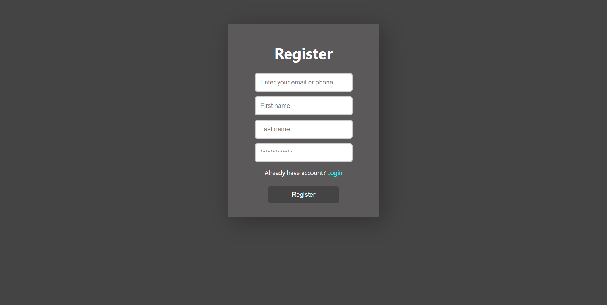

# IstisharyTalk

IstisharyTalk is a simple chat application that reads messages from a JSON file and displays them on a web page, automatically refreshing every second to show the latest messages.


### Prerequisites

- PHP (tested with PHP 7.4+)
- A web server (e.g., Apache) with PHP support, such as XAMPP for local development
- Web browser

### Installation

1. **Clone the repository or download the ZIP file:**
   ```bash
   git clone https://github.com/ademchaoua/IstisharyTalk.git
   ```
   ```bash
   cd IstisharyTalk
   ```

2. **Set up the project directories and files:**

    Ensure the directory structure matches the one shown above.

3. **Configure the Web Server:**

    If using XAMPP, place the project folder inside the `htdocs` directory (e.g., `C:\xampp\htdocs\IstisharyTalk`).

4. **Create or ensure the existence of msgs.json:**

    In the `database` directory, create a `msgs.json` file if it doesn't exist and initialize it with an empty array:

     ```json
    []
     ```
### Permissions

Ensure that the `database` directory and the `msgs.json` file are writable by the web server.

### Running the Application

1. **Start your web server (e.g., XAMPP):**

   * Open the `XAMPP` control panel.
   * Start the `Apache server`.

2. **Access the application in your web browser:**

    Navigate to `http://localhost/IstisharyTalk/`.

### Login & Register 

1. **Login:**
      
    Users can log in by entering their credentials on the login page. The application checks the provided information against registered users stored in the system.

    

2. **Register:**
      
    New users can register by filling out the registration form. Their details are saved for future logins, enabling them to access the chat application.

    

### Using JSON as a Database

IstisharyTalk utilizes `JSON` files to store user credentials and chat messages. This approach provides a straightforward and lightweight solution for data storage.

- **User Credentials:**

  User `email addresses` and `hashed passwords` are stored in `users.json`. Each entry in this file contains the following structure:
  ```json
  [
    {
        "email": "example@example.com",
        "password": "hashed_password"
    }
  ]
  ```
- **User Information:**

  User `email addresses`, `first names`, and `last names` are stored in `userinfo.json`. Each entry in this file contains the following structure:
  ```json
  [
    {
        "email": "example@example.com",
        "first_name": "John",
        "last_name": "Doe"
    }
  ]
  ```

These `JSON` files serve as the backend database for user authentication and identification within IstisharyTalk.

### License

This project is licensed under the MIT License - see the [LICENSE](LICENSE) file for details.